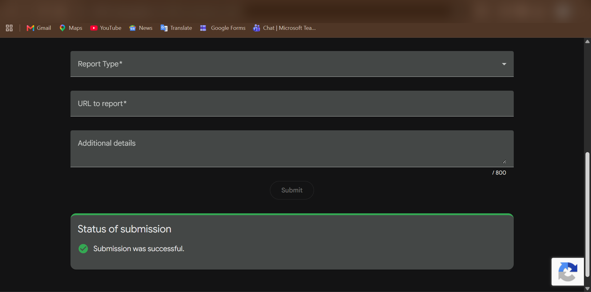
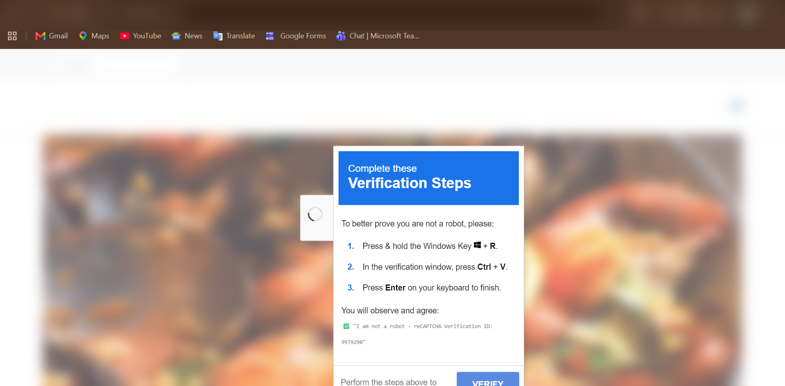
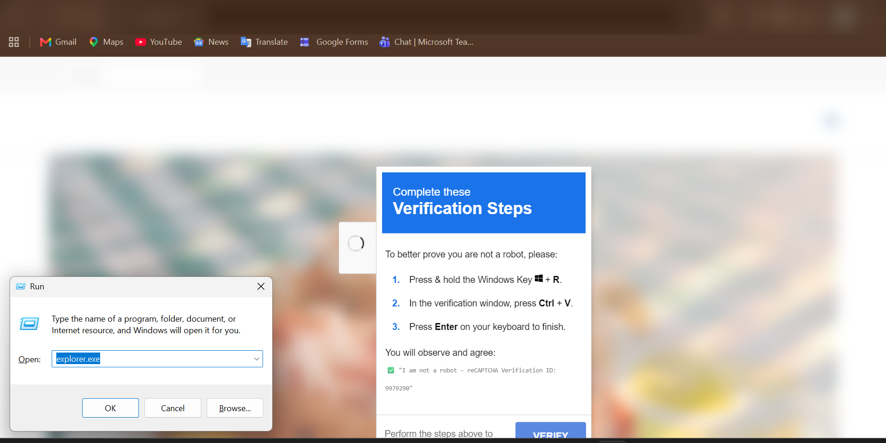

# Case Study: A Compromised Website Serving an On-Chain Malware Loader (EtherHiding + ClickFix)

**Date of discovery:** 25 July 2026
**Target:** A live, legitimate small-business website (Joomla CMS) **domain redacted**, since the site was still compromised and unpatched at time of writing. This is a real, ongoing business unrelated to the attack; the domain is withheld to avoid amplifying exposure or reputational harm to them while the compromise is unresolved.
**Status at time of writing:** Site compromised; report submitted to Google Safe Browsing; not yet flagged as of writing.

---

## How this started

This investigation began because my friend **Sofia Catherine** spotted something suspicious on her own laptop a fake "verification" popup and a strange command window running in the background. Instead of clicking through it, she paused, recognized it didn't look right, and closed it before it could execute. She brought it to me, and that instinct to stop and question it is really what kicked off everything documented below. The technical analysis, deobfuscation, and reporting that follow are mine, but the catch itself was hers.

---

## 1. Summary

A legitimate, long-standing business website was compromised through injection of a malicious JavaScript loader into the page `<head>`. The loader fetches a hidden payload from a Binance Smart Chain (BSC) **testnet** smart contract and executes it via `eval()`. Visitors are additionally served a fake "reCAPTCHA verification" overlay that social-engineers them into manually executing an attacker-controlled command via the Windows Run dialog.

This combines two documented real-world techniques:
- **EtherHiding** — using blockchain smart contract storage to host/serve malware payloads, making takedown very difficult since blockchain data is immutable and not hosted by a provider who can remove it.
- **ClickFix** — a fake CAPTCHA/verification prompt that tricks a user into pressing Win+R, pasting a clipboard payload (silently set by the malicious page), and pressing Enter executing a command the user never sees or types themselves.

## 2. Timeline

| Time | Event |
|---|---|
| T+0 | Sofia's laptop shows a Run/cmd window with a suspicious headless command referencing an unfamiliar external domain |
| T+0 | She recognized it as suspicious and closed it before execution |
| T+~few min | Investigation began: reviewed the site's page source |
| T+~10 min | Identified obfuscated base64 `data:` script injection in `<head>` |
| T+~15 min | Decoded and traced logic to a BSC testnet RPC call + `eval(atob(...))` |
| T+~20 min | Reproduced the fake verification popup live on the site, confirming the ClickFix delivery mechanism |
| T+~30 min | Checked Google Safe Browsing Transparency Report — site not yet flagged ("No unsafe content found") |
| T+~35 min | Submitted a report to Google Safe Browsing |

## 3. Technical Analysis

### 3.1 Injection point
Found in `<head>`, alongside otherwise-normal template scripts (jQuery, Bootstrap, template JS):

```html
<script type="text/javascript">
var s=document.createElement("script");
s.src="data:text/javascript;base64,<LONG_BASE64_BLOB>";
document.head.appendChild(s);
</script>
```

This is a common injection pattern used by compromised-CMS malware: rather than linking to an external `.js` file (which is easy to spot and block via URL/domain), the payload is embedded directly as a `data:` URI, so no external request is needed to *load* the first stage.

### 3.2 Obfuscation
The decoded script uses a **string-array + index-offset** obfuscation pattern (commonly produced by tools like `obfuscator.io`):
- All string literals are stored in one array and shuffled at runtime.
- Function/variable names are replaced with meaningless hex-like identifiers.
- Real function calls are resolved through lookup helper functions rather than being called directly.

This doesn't change *what* the code does it only slows down manual analysis and evades naive static signature scanning.

### 3.3 Payload retrieval (EtherHiding pattern)
Once deobfuscated, the logic:
1. Sends a `POST` request to a public Binance Smart Chain **testnet** RPC node.
2. Calls the `eth_call` JSON-RPC method against a specific contract address, requesting `"latest"` state.
3. Extracts the hex-encoded `result` field from the response.
4. Converts specific byte ranges of that hex data (length-prefixed segments) back into a UTF-8 string.
5. Passes that decoded string to `eval(atob(...))`.

**Why this matters:** the actual next-stage payload is never hosted on the compromised site or any single traditional server. It lives in blockchain contract storage. This means:
- Traditional takedown requests (to a hosting provider, registrar, or CDN) don't remove the payload itself — only the initial loader script on the compromised site.
- The attacker can **update the payload at any time** by writing new data to the contract, without ever touching the compromised website again.
- Using a *testnet* RPC (rather than mainnet) is notable — testnet infrastructure is free to use and less monitored than mainnet, making it a low-cost, low-visibility hosting layer.

### 3.4 Social engineering delivery (ClickFix pattern)
Independent of the loader above, the site (or a payload it triggers) displays a fake verification modal instructing visitors to:
1. Press & hold the Windows Key + R
2. In the verification window, press Ctrl+V
3. Press Enter to finish

**Trigger timing:** across repeated observations, the fake verification popup appeared within 1–2 seconds of the page loading, consistently, on every visit. This indicates the overlay is not behavior-gated (e.g., waiting for scroll depth, mouse movement, or an idle timer to filter out bots/crawlers) — it fires reliably for effectively every visitor to the homepage, increasing the likely exposure of the general public to this attack.

This is the well-documented **ClickFix** technique:
- The page silently writes a malicious command to the victim's clipboard (via JavaScript clipboard API or a hidden copy trigger) *before* showing this prompt.
- The victim is told this is a normal, harmless anti-bot check.
- Win+R opens the Windows Run dialog; Ctrl+V pastes the attacker's command; Enter executes it — all performed by the victim's own hand, bypassing browser sandboxing entirely, since execution happens at the OS level, not inside the browser.
- The command observed on the victim laptop was consistent with a second-stage downloader typical of ClickFix payloads (fetching and running further malware from an attacker-controlled external path/domain).

### 3.5 Why Google Safe Browsing showed "No unsafe content found"
This is expected, not contradictory:
- Safe Browsing relies on periodic crawling, not real-time analysis.
- Payloads served conditionally (e.g., only to real human visitors, not bots — detectable via mouse movement, timing, lack of headless-browser fingerprints) can evade automated crawlers entirely.
- On-chain payload staging means the *malicious behavior itself* can be toggled on/off remotely by the attacker without changing the crawled page source.
- A manual report triggers human/deeper review rather than relying solely on the existing crawl index.

## 4. Indicators of Compromise (IOCs) — sanitized

- Payload-staging technique: BSC testnet RPC `eth_call` against an attacker-controlled contract
- Fake verification/CAPTCHA overlay text pattern: *"Complete these Verification Steps"* / *"I am not a robot - reCAPTCHA Verification ID: [numeric]"*
- Malicious command pattern observed on victim host: a headless console process launching a hidden shell command that maps to an external, randomly-subdomained host
- Full domain-level IOCs (compromised site, C2-adjacent domain) withheld from this public version — available on request for legitimate security research/verification purposes.

## 5. Response Actions Taken

1. Did **not** execute the Win+R/Ctrl+V/Enter sequence — attack chain broken at the social-engineering stage.
2. Disconnected the potentially-affected laptop from the network as a precaution.
3. Did not shut down the machine (to preserve volatile evidence) pending further review.
4. Analyzed page source directly rather than interacting further with the live page.
5. Checked domain reputation via the Google Safe Browsing Transparency Report.
6. Submitted an incident report to Google Safe Browsing.

## 6. Recommendations (for any site owner in this situation)

- Immediately audit all injected `<script>` blocks across every page, not just the homepage.
- Rotate all CMS admin, database, and hosting-account credentials.
- Check for backdoored plugin/component files and unauthorized admin accounts.
- Restore from a known-clean backup if available, rather than only removing the visible injected script (compromise often includes a persistence mechanism/backdoor beyond the visible payload).
- Keep CMS core, template, and all extensions/plugins updated — outdated CMS/plugin versions are the most common entry point for this class of compromise.

## 7. Evidence

**Figure 1 — Safe Browsing report submission confirmation**

Confirmation that the malware report was successfully submitted to Google Safe Browsing. Address bar blurred.

**Figure 2 — Fake "Verification Steps" overlay (ClickFix)**

The fake reCAPTCHA-style overlay served to visitors, instructing them to press Win+R, then Ctrl+V, then Enter — the ClickFix clipboard-hijacking social engineering step. Address bar blurred.

**Figure 3 — Windows Run dialog (illustration only, not executed)**

The Windows Run dialog opened purely to illustrate step 1 of the attack for documentation purposes. **No payload was pasted or executed** — the field shown is Windows' default last-used entry, not the malicious clipboard content. The dialog was closed without pasting or pressing Enter. Address bar blurred.

## 8. Key Takeaways / Learning Points

- **Compromised ≠ fake.** A completely legitimate, real business can have its real website hijacked — the surrounding content being genuine doesn't mean the code is safe.
- **Obfuscation is a smell, not proof by itself** — but combined with behavior (external calls, `eval`), it's a strong signal.
- **On-chain payload hosting (EtherHiding)** is an emerging technique specifically chosen for takedown resistance — worth knowing as CMS-compromise campaigns increasingly adopt it.
- **ClickFix** attacks succeed by exploiting user trust in "routine" verification steps — the victim technically executes the malware themselves, so no browser exploit is needed. Recognizing "no legitimate CAPTCHA ever asks you to open Run and paste something" is a critical defensive instinct.
- **Automated reputation tools have latency and blind spots.** A "clean" Safe Browsing result is not proof of safety — it reflects the last crawl, which can be evaded or simply not yet have happened.

---

*Domain and full IOCs redacted responsibly while the compromise remains unresolved. A complete, unredacted version exists for verification purposes and can be shared privately (e.g. with a prospective employer) on request.*
